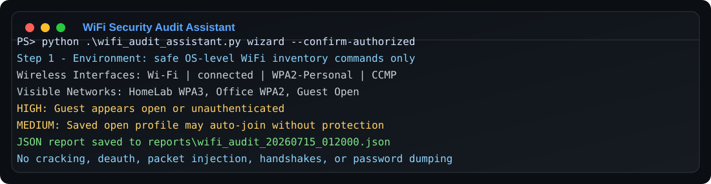

#######################################################################
# Author: Lehlohonolo Adolf Matobakele  
# Email: lehlohonolo.matobakele@gov.ls
# Contacxt: 00266 62320704
#######################################################################

# WiFi Security Audit Assistant

Python CLI for step-by-step defensive WiFi security review. It guides an authorized user through safe WiFi inventory, visible network checks, saved profile security review, findings, and report export.

This is a defensive alternative to automating WiFi hacking notes. It does **not** perform deauthentication, monitor mode, packet injection, handshakes, password cracking, credential capture, or stored password dumping.

Use it only on WiFi networks and devices you own or are explicitly authorized to review.

## Screenshot



## Features

- Interactive `wizard` mode that prompts before each step.
- Safe `learn` and simulated `lab` modes for educational use without touching a real target.
- Non-interactive `scan` mode for a full safe audit.
- Dedicated `nearby` command to search nearby WiFi networks safely.
- Local passphrase strength estimation for a sample pattern, without saving secrets.
- Windows `netsh wlan` support for interfaces, visible networks, and saved profile security settings.
- Linux `nmcli` support for visible network inventory when available.
- Flags open networks, WEP, TKIP, weak saved profiles, risky auto-join behavior, and hidden SSID misconceptions.
- Does not reveal saved WiFi passwords or secrets.
- JSON and CSV report export.

## Setup

```powershell
python -m venv .venv
.\.venv\Scripts\Activate.ps1
python -m pip install -r requirements.txt
```

## Run The Step-By-Step Wizard

```powershell
python .\wifi_audit_assistant.py wizard --confirm-authorized
```

You can also run the default wizard by launching the script with no command:

```powershell
python .\wifi_audit_assistant.py
```

## Run A Full Safe Scan

```powershell
python .\wifi_audit_assistant.py scan --confirm-authorized --include-profiles
```

## Search Nearby WiFi

Show nearby WiFi networks:

```powershell
python .\wifi_audit_assistant.py nearby --confirm-authorized
```

Show access point BSSID details too:

```powershell
python .\wifi_audit_assistant.py nearby --confirm-authorized --show-bssids
```

Search nearby WiFi and show defensive findings:

```powershell
python .\wifi_audit_assistant.py nearby --confirm-authorized --analyze
```

Save nearby WiFi results:

```powershell
python .\wifi_audit_assistant.py nearby --confirm-authorized --json-out .\reports\nearby_wifi.json --csv-out .\reports\nearby_wifi.csv
```

## Learn Safely

Show a defensive learning path:

```powershell
python .\wifi_audit_assistant.py learn --confirm-authorized
```

Run a simulated step-by-step lab using fake WiFi data:

```powershell
python .\wifi_audit_assistant.py lab --confirm-authorized
```

Run the simulated lab without prompts:

```powershell
python .\wifi_audit_assistant.py lab --confirm-authorized --yes
```

Estimate a sample passphrase pattern. For privacy, test a similar pattern instead of your real production WiFi password:

```powershell
python .\wifi_audit_assistant.py passphrase-check --confirm-authorized
```

## Save Reports

```powershell
python .\wifi_audit_assistant.py scan --confirm-authorized --include-profiles --json-out .\reports\wifi_audit.json --csv-out .\reports\wifi_findings.csv
```

## Show Wireless Interfaces

```powershell
python .\wifi_audit_assistant.py interfaces --confirm-authorized
```

## What This Tool Will Not Do

- No WiFi password cracking.
- No WPA/WPA2 handshake capture.
- No deauthentication or client disruption.
- No monitor mode automation.
- No packet injection.
- No stored WiFi password dumping.
- No bypassing access controls.

## Defensive Next Steps

Use findings to:

- Replace open/WEP/TKIP networks with WPA3 or WPA2-AES.
- Remove saved open networks and disable risky auto-join behavior.
- Confirm all access points broadcasting the same SSID are authorized.
- Keep router and access point firmware updated.
- Use long unique passphrases or enterprise authentication.
